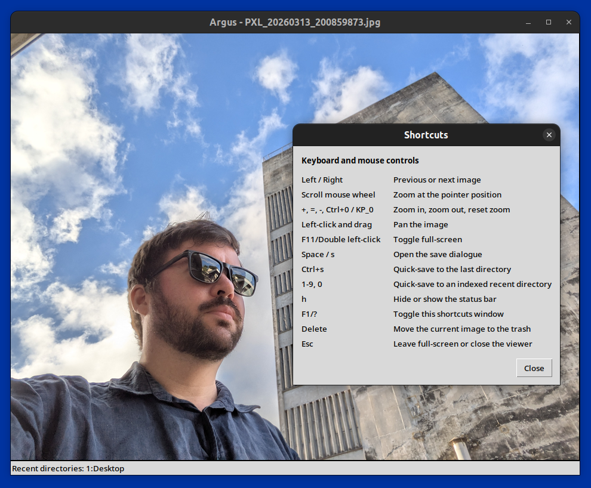

# Argus



Argus is an image viewer and saver with keyboard shortcuts support and the ability to save to multiple recently-used directories at once.

It can

- browse images at a directory with wrap-around left and right navigation and neighbour preloading,
- accept either a directory path or image file paths on launch,
- zoom with the mouse wheel or keyboard, centred on the pointer,
- pan by dragging the image,
- render larger images efficiently with viewport cropping, mipmaps and progressive refinement,
- save the current image to one or more recent directories,
- quick-save to the last selected or most recent directory with `Ctrl+s`,
- save to indexed recent directories with `1` to `9`, and `0` for the tenth entry, and
- move the current image to the system trash.

## setup

```bash
python3 -m pip install docopt pillow send2trash
./install.sh
```

## usage

### command-line options

- `--no-status-messages`: disable the transient status messages shown after successful saves and deletes
- `--status-messages`: explicitly enable transient status messages

## controls

|**cause**                                      |**effect**                                                     |
|-----------------------------------------------|---------------------------------------------------------------|
|`Left`/`Right`                                 |move to the previous or next image                             |
|scroll mouse wheel                             |zoom in or out at the pointer position                         |
|`+`, `=`, `-`, `Ctrl+0`/numpad `0`             |zoom in, zoom out, or reset zoom                               |
|left-click and drag                            |pan the image                                                  |
|`F11`/double left-click                        |toggle full-screen mode                                        |
|`Space`/`s`                                    |open save dialogue                                             |
|`Ctrl+s`                                       |quick-save to last selected or most recent directory           |
|`1` to `9`, `0` for the tenth entry            |save directly to the indexed recent directory                  |
|`h`                                            |hide or show the bottom status bar                             |
|`F1`/`?`                                       |show or hide the shortcuts help window                         |
|`Delete`                                       |move current image to trash                                    |
|`Esc`                                          |leave full-screen mode, or close the viewer if not full-screen |

## saving

The save dialogue is opened with `Space` or `s` and allows one to edit the filename and save to multiple directories at once. It shows up to 20 recent directories as clickable buttons, with radio buttons to list them alphabetically or by most recent use; alphabetical listing is selected by default. The dialogue-local `1` to `9` and `0` shortcuts apply to the first ten directories currently shown. A `Move` checkbutton sits between `Cancel` and `Save`; when it is enabled, Argus removes the current source image after transferring it, and then advances to the next image or clears the viewer if none remain. The `Move` state is kept only for the current Argus session. Pressing `Enter` triggers `Save`, and `Escape` closes the dialogue. `Alt+1` to `Alt+9`, and `Alt+0` for the tenth entry save to the matching indexed recent directory.

Quick-save (`Ctrl+s`) uses the last directories selected in the save dialogue during the current session. If no directories have been selected in the current session, quick-save falls back to the most recent saved directory from the recents list. If there is no recent directory yet, quick-save opens the save dialogue instead.

Existing files are not overwritten. The viewer saves as `name (copy N).ext` as needed.

## recent directories persistence

Argus creates its configuration directory at `~/.config/argus` on launch. Recent save directories are stored at `~/.config/argus/recent_directories.json` (a JSON array of absolute, resolved directory paths). The list is deduplicated and kept in most-recent-first order. Argus records at most 20 recent directories. A directory is pushed to the front of the list when one saves successfully to it, or when one chooses it with `Browse...` in the save dialogue. The save dialogue shows all 20 recorded directories as clickable buttons when available. The numbered recent-directory shortcuts use the stored order for only the top 10 entries, with `1` being the most recent directory, `2` being the next-most recent, and `10` being the tenth-most recent. Any recorded directories that are no longer valid are ignored when loading the list of recorded directories. The list of recent directories can be cleared by selecting `Clear recent directories`. The per-session `last selected directories` state used by `Ctrl+s` is not written to drive. Only the persistent recents list is stored between runs.
